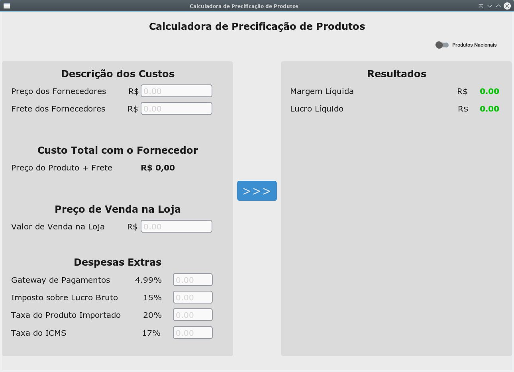

# Programa de Precificação de Produtos

### Fiz este programa com python 3.11.2 para conseguir visualizar meu lucro na venda de produtos nacionais e importados. Você pode baixar e implementar novas funcionalidades se quiser.

## Como usá-lo?

### Para executá-lo faça os seguintes passos:

Primeiro crie uma pasta em seu pc, baixe todos arquivos para esta pasta recém criada. Então depois disso você precisará instalar os requerimentos necessários para o programa ser executado de boa. 
Mas antes disso, é altamente recomendado a construção de um ambiente virtual no python para dar continuidade no processo da execução do programa python.

Com os arquivos dentro da pasta então, faça os seguintes comandos:

### Ambiente virtual criado com módulo venv:
    python3 -m venv nome_para_sua_pasta_virtual

### Entrando no ambiente vitual do python3 no linux:
    source ./nome_para_sua_pasta_virtual/bin/activate

### Instalando os requerimentos:
    pip install -r dependencias.txt

### Executando o programa que eu fiz:
    python main.py

### Para sair do ambiente virtual do python3 no linux:
    deactivate
